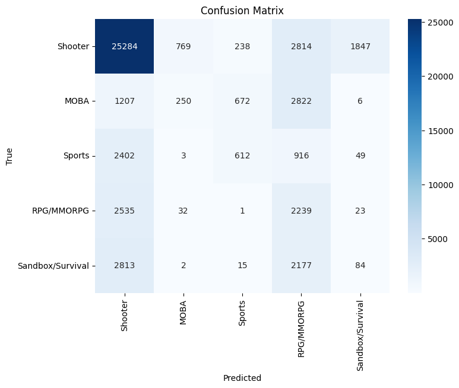
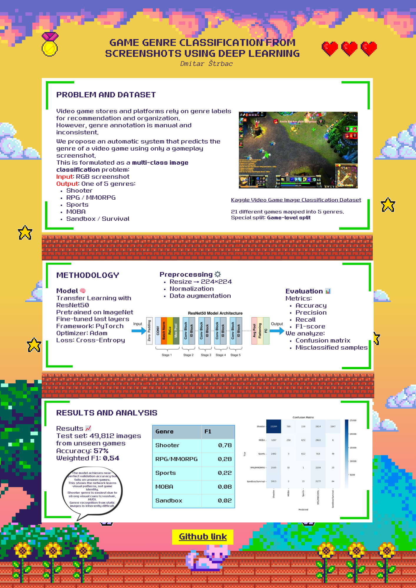

# 🎮 Game Genre Classification from Screenshots

Deep learning project for automatic classification of video game genres from gameplay screenshots using transfer learning.

---

## 🧠 Problem Description

The goal of this project is to develop a deep learning model capable of predicting the **genre of a video game** based solely on a screenshot.

The task is formulated as a **multi-class image classification problem**:

**Input:** RGB image (game screenshot)  
**Output:** One of the following genres:

- 🔫 Shooter
- 🧙 RPG / MMORPG
- ⚽ Sports
- 🏟️ MOBA
- 🌍 Sandbox / Survival

To ensure the model learns **genre characteristics rather than specific games**, the dataset is split using a **game-level split**.  
This means some games are completely excluded from training and used only for testing.

---

## 🎯 Motivation

Automatic video game genre recognition has applications in:

- 📺 Content recommendation systems (Steam, YouTube, Twitch)
- 🗂️ Automatic media organization and filtering
- 📊 Video game market analysis

The project focuses on generalization to unseen games — a realistic scenario in industry systems.

---

## 🗃️ Dataset

We use the public Kaggle dataset:

👉 https://www.kaggle.com/datasets/juanmartinzabala/videogame-image-classification

It contains screenshots from 21 games:

*ApexLegends, CSGO, ClashRoyale, DeathByDaylight, Dota2, EscapeFromTarkov, FIFA21, Fortnite, FreeFire, GTAV, LeagueOfLegends, Minecraft, Overwatch, PUBG_Battleground, RainbowSix, RocketLeague, Rust, SeaOfThieves, Valorant, Warzone, WorldOfWarcraft*

Each game is mapped into one of the 5 defined genres.

> Dataset is NOT included in the repository due to size.

---

## ⚙️ Methodology

### Preprocessing
- Resize images to **224×224**
- Normalization
- Data augmentation (flip, crop, rotation, color jitter)

### Model
- 🧠 **ResNet50 (pretrained on ImageNet)**
- Transfer learning
- Fine-tuning last layers

### Training
- Loss: Cross-Entropy
- Optimizer: Adam
- Framework: PyTorch

---

## 📊 Evaluation

### Data Split (Game-Level)
- Test set: at least 1 game per genre
- Training set: remaining games
- Validation set: 20% of training images

### Metrics
- Accuracy
- Precision
- Recall
- F1-Score

### Analysis
- Confusion Matrix
- Misclassified samples inspection

---

## 🚀 Setup

```bash
git clone https://github.com/dmitar-strbac/game-genre-classification.git
cd game-genre-classification
python -m venv .venv
source .venv/bin/activate   # Windows: .venv\Scripts\activate
pip install -r requirements.txt
```

Download dataset manually and place it inside:
```
data/raw/
```

---

## 🏁 Training
```
python src/train.py
```

---

## 🧪 Evaluation
```
python src/evaluate.py
```
---

## 🔍 Single Image Prediction
```
python src/predict.py --image "path/to/screenshot.png"
```

---

## 📈 Results

Final model evaluated on unseen games (game-level split, 49,812 test images):

| Metric | Value |
|------|------|
| Accuracy | **57%** |
| Weighted F1-score | **0.54** |
| Macro F1-score | **0.28** |

### Per-class performance

| Genre | Precision | Recall | F1 |
|------|------|------|------|
| Shooter | 0.74 | 0.82 | 0.78 |
| MOBA | 0.24 | 0.05 | 0.08 |
| Sports | 0.40 | 0.15 | 0.22 |
| RPG/MMORPG | 0.20 | 0.46 | 0.28 |
| Sandbox/Survival | 0.04 | 0.02 | 0.02 |

### Confusion Matrix


---

## 💬 Discussion

Although the model achieves near-perfect validation accuracy (>99%), performance drops on unseen games due to the game-level split.
This indicates the model learns general visual patterns rather than memorizing specific games.

Certain genres (e.g. Shooter) contain strong visual cues such as crosshair and first-person HUD, making them easier to classify.
Other genres (MOBA, Sandbox/Survival) require semantic understanding beyond a single screenshot, which limits CNN performance.

This demonstrates the inherent difficulty of genre recognition from static images.

---

## 📄 Research Poster



Full PDF: [poster.pdf](docs/poster.pdf)

---

## 👤 Author
**Dmitar Štrbac**  
Faculty of Technical Sciences, University of Novi Sad

---

## 📜 License
MIT License
